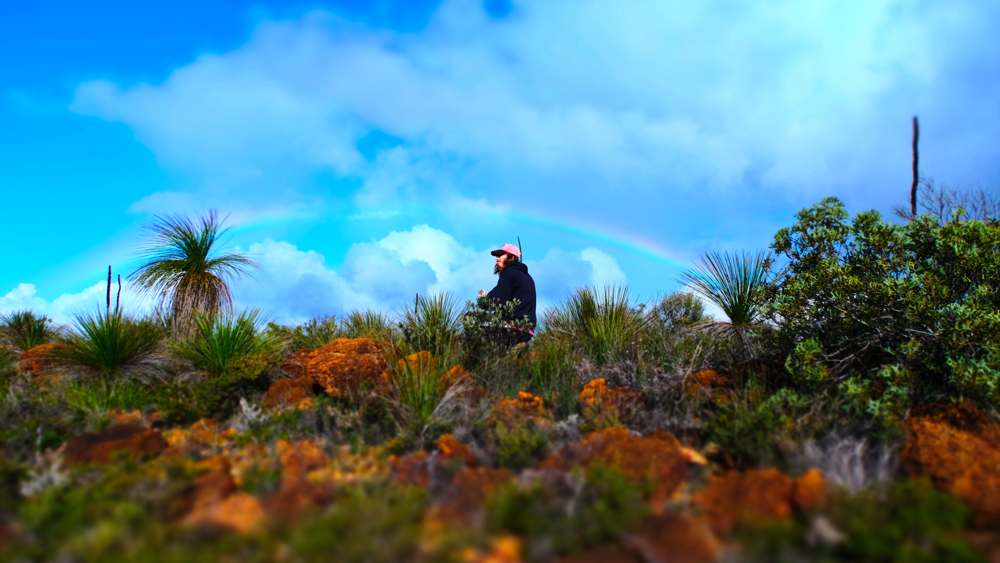

My name's Thomas Mesaglio and I'm a PhD candidate at the University of New South Wales Sydney; my thesis focuses on quantifying our knowledge of Australian plant biodiversity, and developing identification tools, survey and species description protocols, and general data frameworks for improving this knowledge. Although most of my research over the past few years has focused on analyses of citizen science data, I've published scientific papers across a wide range of disciplines, including marine forensics, bushfire recovery and invertebrate ecology and taxonomy. You can view my papers and other academic works at [this link](https://orcid.org/0000-0002-1096-6066).

I've worked a lot on bushfire-related research over the past few years, mostly relating to documenting the recovery/return of organisms in/to firegrounds, and was honoured to receive the [2022 Department of Industry, Science and Resources Eureka Prize for Innovation in Citizen Science](https://australian.museum/get-involved/eureka-prizes/2022-eureka-prize-winners/) as part of the Environment Recovery Project team. 

I'm heavily involved in BioBlitzes across Australia as an organiser, survey leader and participant. I organised the City Nature Challenge for Sydney from 2020-2022, was one of the founding organisers of the Great Southern BioBlitz and organised the Sydney effort from 2020-2022, and co-organised the 2022 Big Bushfire BioBlitzes with Casey Kirchhoff. I also recently attended the 2022 Desert Discovery expedition to Yeo Lake Nature Reserve on the western edge of the Great Victoria Desert in Western Australia, and did almost four weeks of BioBlitzing across Western Australia with Nick Lambert, Pete Crowcroft, Ruby Stephens and Sophie Yang as part of fieldwork for my PhD, taking ~39,000 photographs of >1600 species during this time.

I'm a huge proponent of the online biodiversity citizen science platform iNaturalist, on which I'm a curator and forum moderator. I've uploaded over 48,000 observations to the platform across more than 7000 species, and have made >290,000 identifications for other users. You can find me on iNaturalist as ['thebeachcomber'](https://www.inaturalist.org/people/thebeachcomber).

I've also written two books: a short ebook on scientific etymology, [It's Helico-pter, not Heli-copter: A Beginner's Guide to Deconstructing Scientific Words and Names](https://www.amazon.com.au/dp/B082Y712YD), and a hardcover field guide, [Seashells of North Haven Beach](https://seashellsofnorthhavenbeach.company.site). 

Please feel free to contact me at anytime, whether about this survey or anything else, at either thomasmesaglio@hotmail.com or thomasmesaglio@gmail.com.

