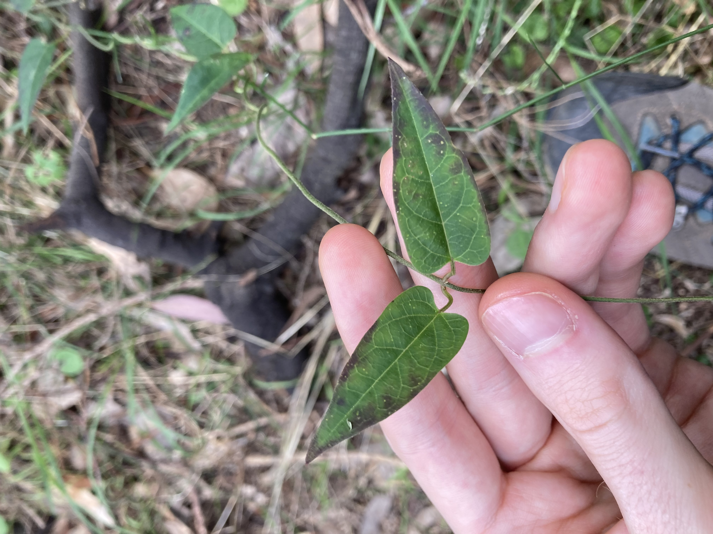
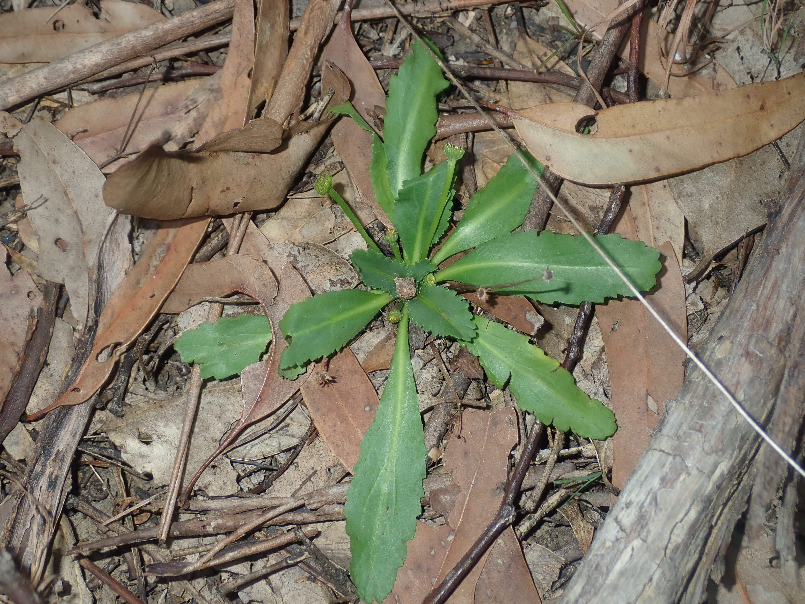

Whilst there are many plant species that are significant or locally rare within the survey area, represented by just one or a small handful of individuals, a lot of these are more common/widely distributed across Sydney or NSW. However, as listed by James, McDougall and Benson in their 1999 [Rare Bushland Plants of Western Sydney (2nd edition)](https://www.researchgate.net/publication/331586736_Rare_Bushland_Plants_of_Western_Sydney_Second_edition_1999), there are five regionally significant plants considered rare in Western Sydney that I've observed in the reserve. 

1. *Vincetoxium woollsii*    
This is the most significant plant, and perhaps the most significant species in general, that I recorded from the survey area. This is a federally and state-listed endangered species. After first being collected in the 1860s at Parramatta, it was not seen in Sydney until 1999, and indeed in the 1999 *Rare Bushland Plants of Western Sydney*, this species was listed as *"now believed extinct in Sydney region"*. However, a small patch was discovered by Colin Gibson in Norfolk Reserve, Chullora (~5.6 km southeast of Wategora Reserve). That patch seemingly died out in the early 2000s during the Millennium Drought, but has now reappeared there after heavy rains during the La Niña conditions of the past couple of years. In November 2021, I found two individuals growing at the base of a *Eucalyptus fibrosa* in the reserve, a significant discovery. This population is currently unprotected and under considerable threat, with *Ehrharta erecta* constantly threatening to smother the two plants, and oleander aphids (*Aphis nerii*) attacking and defoliating the plants after jumping across from nearby patches of the invasive climber *Araujia sericifera*. Conserving this population should be a high priority. In late November 2021, Daniel Smart collected a small cutting (under license) of one of the two individuals and propagated it in his greenhouse. It grew rapidly, and in late September 2022 it began to flower prolifically. Flowering is yet to occur at the in situ population.

2. *Acacia pubescens*   
Endemic to the Sydney region, this threatened wattle is listed as vulnerable under federal legislation. Much of its remaining occurrences are as very small patches or individuals along trainlines or roadsides, however, Wategora Reserve is one of its last bastions; it's common and widespread throughout almost all sections of the survey area, with many large patches formed by suckering.  

3. *Callistemon linearifolius*    
Listed as vulnerable at a state level, this threatened bottlebrush is listed as a 'data-deficient' species by the Saving Our Species program. Scattered individuals and small stands are present throughout the reserve, totalling ~15-20 individuals. 

4. *Solenogyne dominii*       
This small Asteraceae is relatively rare in Sydney. I recorded this species at only three locations within the survey area, all of them in the northern bushland, and two of them represented by just one individual.

5. *Stackhousia muricata*    
Another species with very few collections from Sydney, and even fewer recent records. This species appeared across a number of sections of bushland in the reserve immediately after heavy rain in mid-November 2021. 

