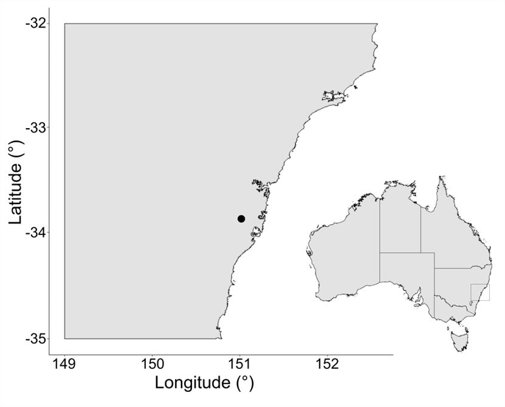

Stretching ~1.3 km from north to south, and ~350 m at its widest point, my survey area covered ~25 ha (0.25 km2) across Wategora Reserve and, immediately south of it, the riverine vegetation adjacent to Everley Park. Located in western Sydney, New South Wales, the survey area spans the suburbs of Chester Hill and South Granville, and is under the jurisdiction of Cumberland Council. It is in a highly urbanised area, and is surrounded by sporting fields, a golf course, and industrial estates and commercial properties. 

The survey area can be split into two sections. The southern section is what I refer to as the **southern riverine stretch**, and consists of the eastern section of Everley Park, the riverine vegetation to the immediate east of the park, and Duck River. This vegetation belongs to the critically endangered ecological community *Sydney Coastal River Flat Forest*, specifically the Alluvial Woodland form, however, it is highly degraded and weed-infested. This section of the creek and its vegetation have undergone extensive management in the past few decades, including spraying and removal of weeds, native species plantings, and erosion control. In particular, much of the native mid- and understorey along this stretch has been planted or has self-seeded from plantings. The map below shows this section.

The northern section constitutes Wategora Reserve itself, including Duck River and a small tributary of it extending westwards into the reserve. The riverine vegetation along the creek is also Sydney Coastal River Flat Forest, but the core vegetation throughout the reserve is *Cooks River/Castlereagh Ironbark Forest [in the Sydney Basin]*, also a critically endangered community. The reserve has also undergone extensive management in the past few decades, including spraying and removal of weeds, native species plantings, and erosion control, but much of the vegetation is remnant/naturally occurring. The map below shows this section. 

