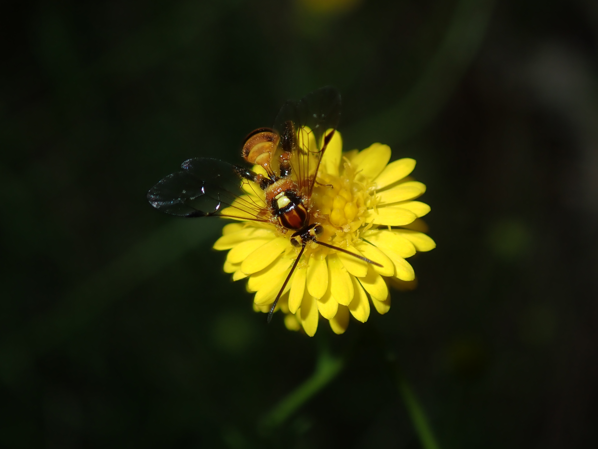

Across 378.6 hours of surveying, I recorded 1926 species. I provide an exhaustive annotated and illustrated checklist for every one of these species in my final report itself, but in summary:

**Algae - 2 species.** Both green algae: *Cladophora glomerata*, submerged in the creek, and *Basicladia ramulosa* growing as an epibiont on the carapace of an Eastern Long-necked Turtle (*Chelodina longicollis*).

**Bryophytes - 24 species.** One hornwort (*Phaeoceros carolinianus*), 11 liverworts and 12 mosses. Includes 2 non-native species: the liverwort *Lunularia cruciata* and the moss *Leptodictyum riparium*.

**Vascular plants - 569 species.** Spread across 7 aquatic plants, 38 climbers, 108 graminoids, 11 ferns, 226 herbs, 72 shrubs, 16 subshrubs, 16 succulents and 75 trees. Natives (287 species) outnumbered by non-natives (308).

**Birds - 62 species.** Spread across 12 feeding guilds, and including 4 non-native species. 

**Mammals - 6 species.** Two natives (both bats, Grey-headed Flying-fox [*Pteropus poliocephalus*] and an unidentified bat), and 4 non-natives.

**Amphibians - 3 species. Striped Marsh Frog (*Limnodynastes peronii*), Common Eastern Froglet (*Crinia signifera*) and Peron's Tree Frog (*Litoria peronii*).   

**Reptiles - 13 species.** Includes 2 dragons, 1 gecko, 7 skinks, 2 snakes and 1 turtle. 

**Fishes - 4 species.** Two natives and 2 non-natives. 

**Nematodes - 1 species.** Present as leaf galls on *Angophora floribunda*, created by an association between a nematode (*Fergusobia* sp.) and a fly (*Fergusonina* sp.).

**Segmented worms - 5 species.** Four 'earthworm' species and 1 leech (unidentified erpobdellid). 

**Flatworms - 4 species.** Three terrestial geoplanid flatworms, and 1 aquatic flatworm  (unidentified Dalytyphloplanida). 

**Hydrozoans - 1 species.** *Hydra* sp. attached to the shell of a live *Physa acuta* snail. 

**Molluscs - 12 species.** Five aquatic snails (including 1 non-native, *Physa acuta*), 1 native terrestrial snail (*Sauroconcha sheai*) and 6 non-native terrestrial snails and slugs.

**Arachnids - 125 species.** Mostly spiders (110 species), but also includes 12 mites, 1 harvestman, 1 scorpion and 1 pseudoscorpion.

**Crustaceans - 10 species.** Six terrestrial species (4 woodlice and 2 amphipods) and four aquatic species (1 copepod, 2 ostracods and 1 water flea). 

**Myriapods - 14 species.** Six centipedes, 5 millipedes and 1 pseudocentipede (unidentified scutigerellid).

**Entognathans - 12 species.** Eleven springtails and 1 dipluran (unidentified Rhabdura).

**Insects - 941 species.** Spread across 25 major groups (mostly equivalent to orders), with moths (198 species), flies (167 species) and beetles (165 species) the most diverse.

**Slime moulds - 3 species.** One unidentifiable beyond class (Myxomycetes), along with *Arcyria obvelata* and *Tubifera ferruginosa*. 

**Cyanobacteria - 2 species.** One found growing on wet, hard-packed clay along the creek banks, and one growing on the surface of sewage overflow.

**Fungi - 113 species.** Spread across 15 groups based on fruiting body morphology.

