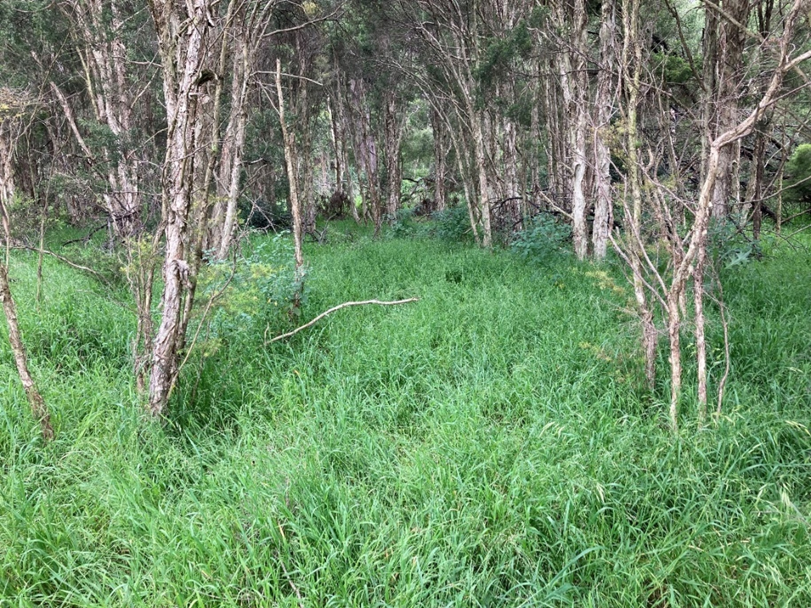

I will keep this section brief, as it is comprehensively treated within my final report itself, but the survey area is threatened by a myriad of processes and entities, including (but not limited to) the invasion by non-native species, erosion, weather extremes, pollution, and inadequate management. 

Undoubtedly, the most significant current threat to the reserve's biodiversity is the proliferation and spread of non-native plants. During my survey I observed 308 non-native plant species, exceeding the number of natives (287). Although many of these non-natives are having little to no impact on biodiversity in the survey area, e.g., singular occurrences of garden escapees such as *Dimorphotheca ecklonia* or *Dracaena draco*, a great number of non-native plant species are negatively impacting the survey area's biodiversity right now, with impacts including altered water flow, spread of disease, creation of excess shade, smothering of native trees and shrubs, and outcompetition/displacement of native species. 

Probably the greatest threat out of any non-native plant species in the survey area is the grass *Ehrharta erecta*. It has spread and proliferated into almost every section in the entire survey area, including the most intact and otherwise weed-free sections of bushland and woodland. Even within the short timespan of my survey, I watched it spread and increase in abundance, responding especially positively after heavy rain in 2022. In some areas, it has formed astonishingly large patches to the detriment of all other grasses and herbs. I suspect it is far too late to eliminate it entirely from the survey area, and control efforts may have to be limited to halting any further spread. Although always abundant along the creek during my survey, *Tradescantia fluminensis* has also exploded throughout 2022, also in response to rain, and is one of the biggest threats after *Ehrharta erecta*. It has now begun to invade bushland at a number of locations (e.g., it has already crept into the edges of the southern grassy woodland, and almost entirely smothered the *Macrozamia spiralis* growing there) and should be one of the highest priorities to deal with.

Notably, I also observed three naturalised, non-native plant species within Wategora Reserve that were previously unrecorded by PlantNET as naturalised in NSW: *Rothmannia globosa*, *Salvia hispanica* and *Ruta chalepensis*. 

The photo below highlights the now total dominance of the undergrowth by *Ehrharta erecta* in many sections of the reserve.

